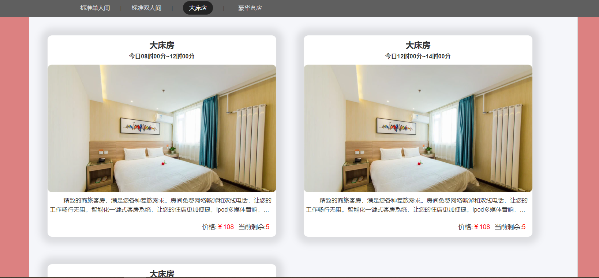

## 三级导航展示goods

点击不同的标签，展示不同种类的商品。

其实这里可以用最通常的做法，整体只需一个组件，点击不同的标签，只需根据标签内容filter出不同的goods即可。

但我这里并没有这样，我将这些标签作为了三级导航的`NavLink`

* 好处：
  * 由于不同router映射不同的cpn，所以后期比较容易做些页面的个性化配置
* 缺点：
  * 由于几乎所有逻辑都是相同的，会出现很多的重复代码。

